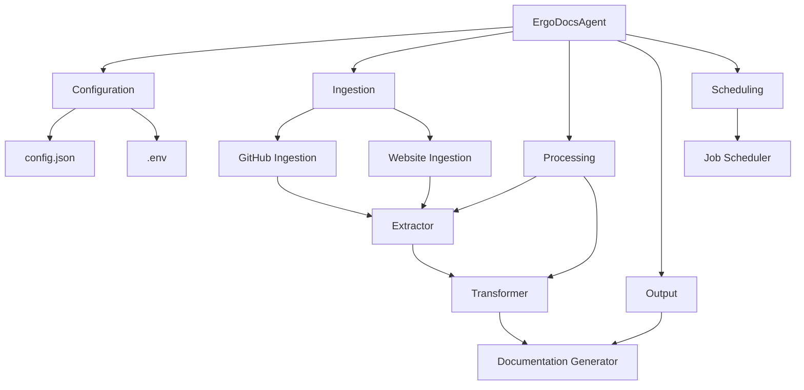
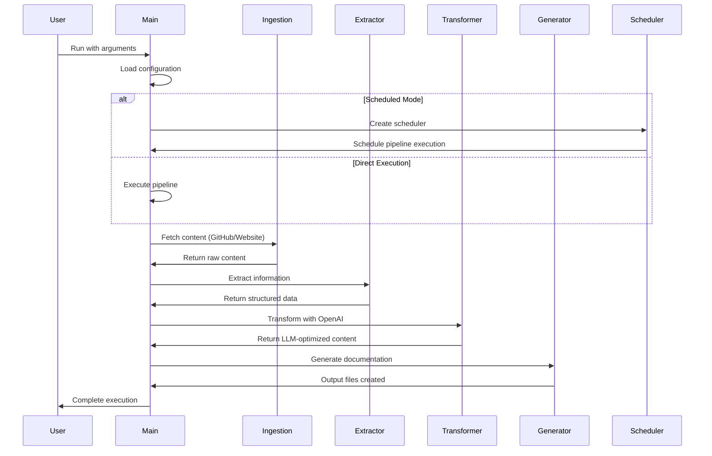
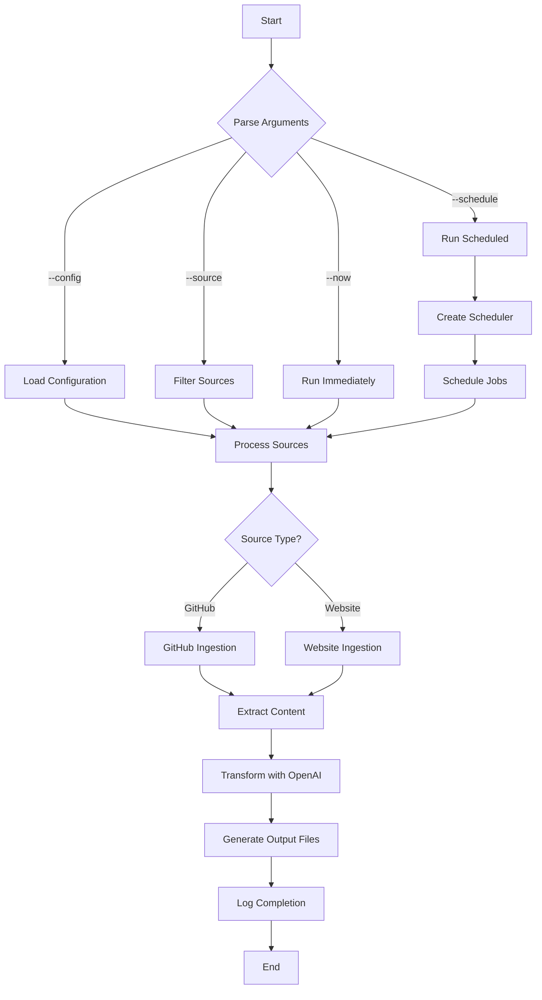
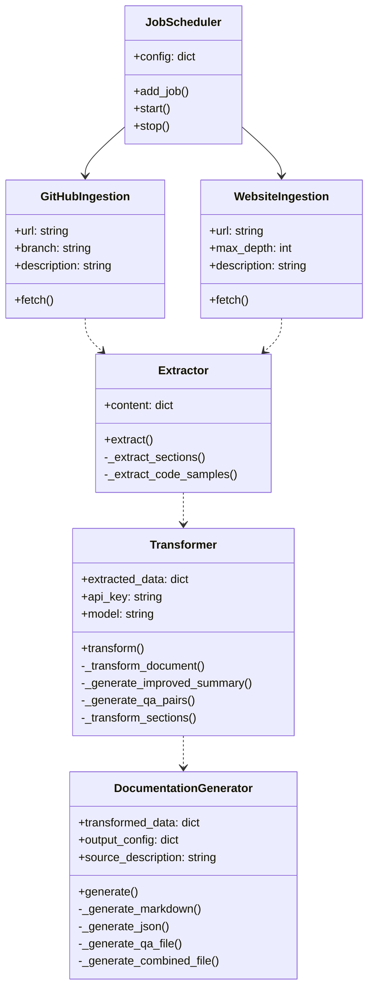

# ErgoDocsAgent Architecture Diagrams

This document contains visual representations of the ErgoDocsAgent architecture, workflow, and components.

## Component Architecture

## Sequence Diagram

## Process Flow

## Class Diagram

